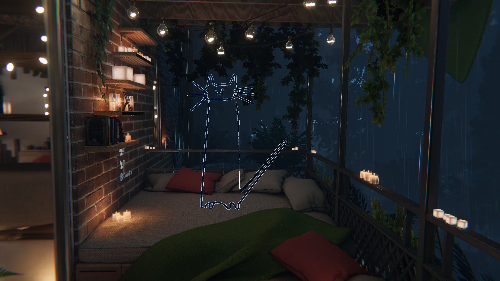
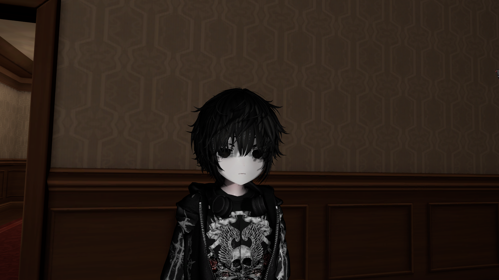

  

---

### about me
im nex and i do stupid shit

**Favorite Game(s)**: [Gorilla Tag](https://store.steampowered.com/app/1533390/Gorilla_Tag/), [Satisfactory](https://www.satisfactorygame.com/), [Primal Paradox: Legacy](https://www.meta.com/experiences/primal-paradox-legacy/24357639250551331/?srsltid=AfmBOoo6khf8EptAvDv1xCzE8a-hGPEtcGeuzqUqLze_M9kVApjqB_8e)*

---

### an about me that exists
[About Me](https://luminateam.dev/about)

---

### tech

| **Category**      | **Stack**                                                                 |
|-------------------|---------------------------------------------------------------------------|
| **Languages**     | , , ,  |
| **Engines**       | 

---

### expertise
- writing *dogshit* code that works on hopes and dreams

---

### talk to me
- **Website:** [luminateam.dev](https://luminateam.dev)  
- **Discord:** .kairo.nex  
- **Email:** nex@luminateam.dev
- **More Contact:** [My Contact Info](https://luminateam.dev/contact)

---
> _"wdmvnw"_

  
  
  
  
  
  
  
  
  
  
  
  
  
  
  
  
</
